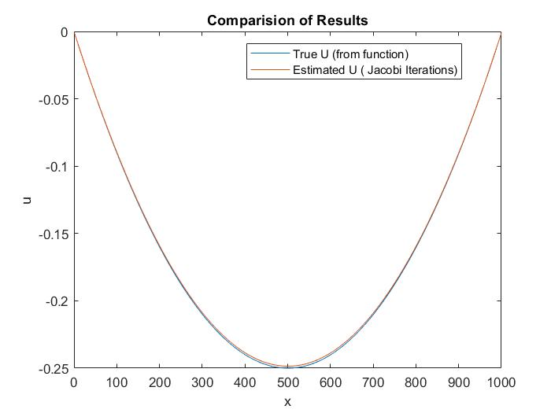

# Parallel Gauss-Seidel Method
In this tutorial , I implement a  parallel Gauss Seidel algorithm  to approximate a partial differential equation (PDE).

## compare plots 
fromMPI = importdata('output.txt'); 
u_ode= @(x) power(x,2) - x; 
N=1000; 
x = linspace(0, 1, N+2); 
x = x(2:end-1); 
u = u_ode(x); 
plot(u); 
hold all; 
plot(fromMPI); 

## solve pde analytically  
https://se.mathworks.com/help/symbolic/solve-a-single-differential-equation.html 
syms y(x) 
ode = diff(y,x,2) ==x*y+2-x *x *(x-1) 
cond1 = y(0) == 0 
cond2 = y(1) == 0 
conds = [cond1 cond2]; 
ySol(x) = dsolve(ode,conds) 

## RESULTS
</img> 
</img> 
 