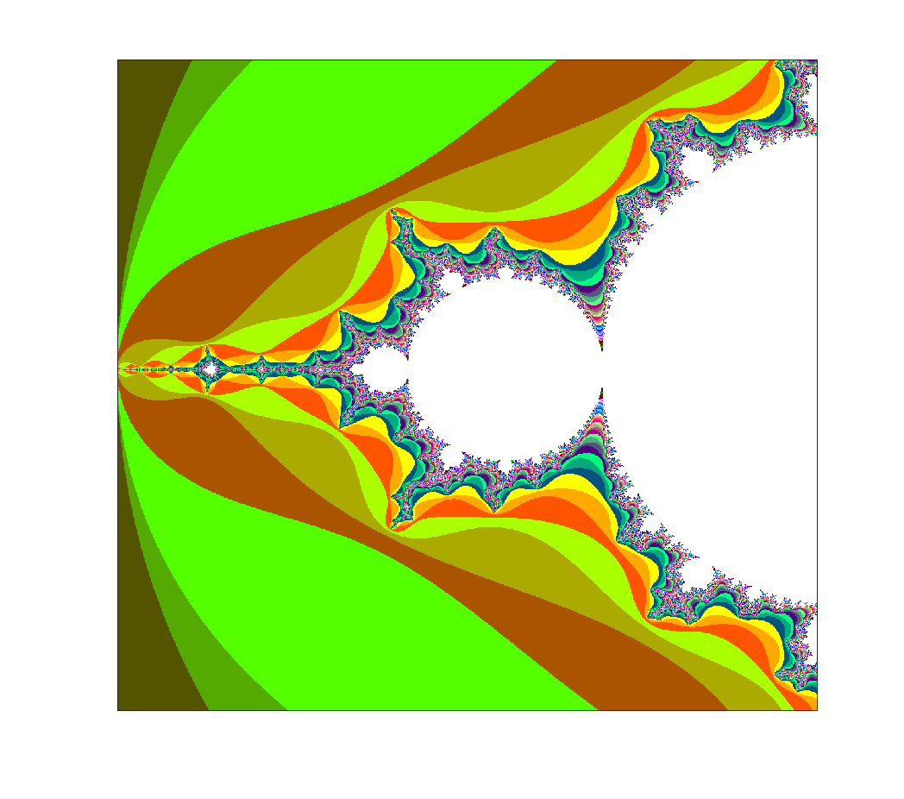
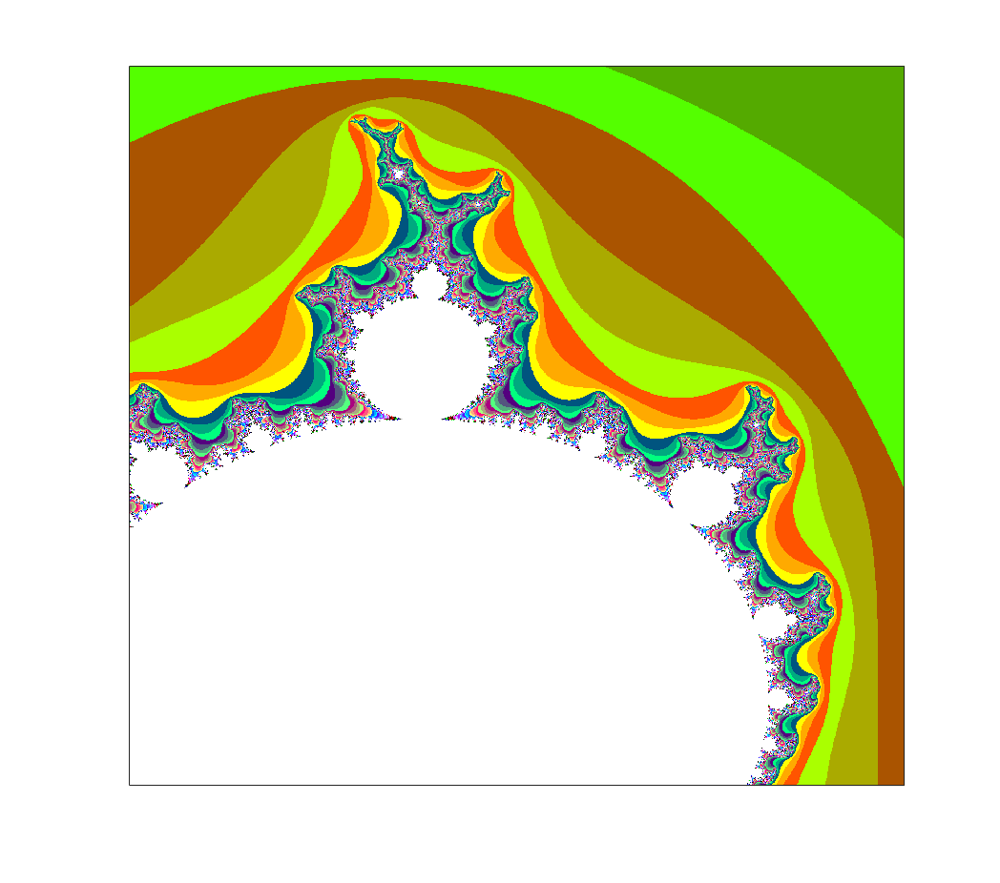
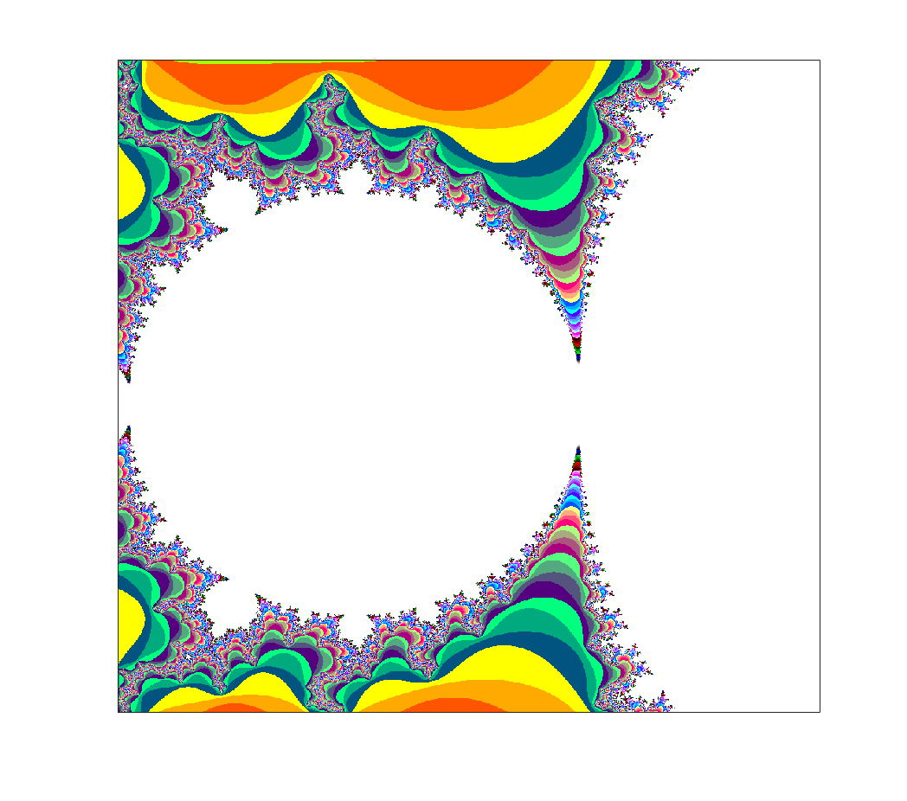

# Parallel implementation of Mandelbrot
In this tutorial, i implement the Mandelbrot program using MPI. Assumption:
number of processors divides the number of columns evenly. 

## RESULTS
</img> 
</img> 
</img> 
</img> 
</img> 
</img> 
 
